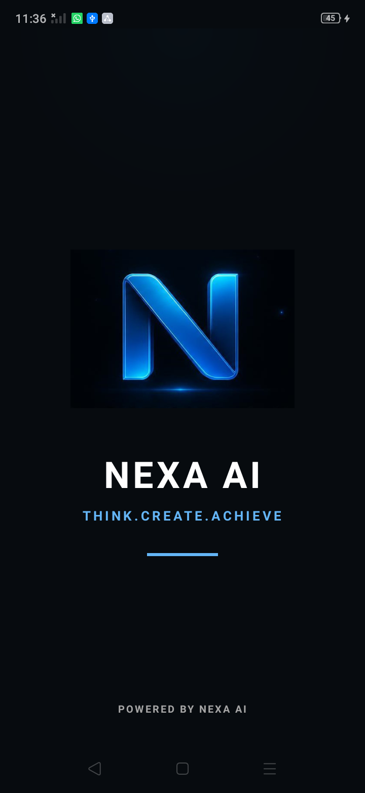
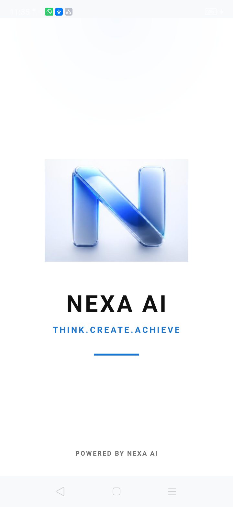
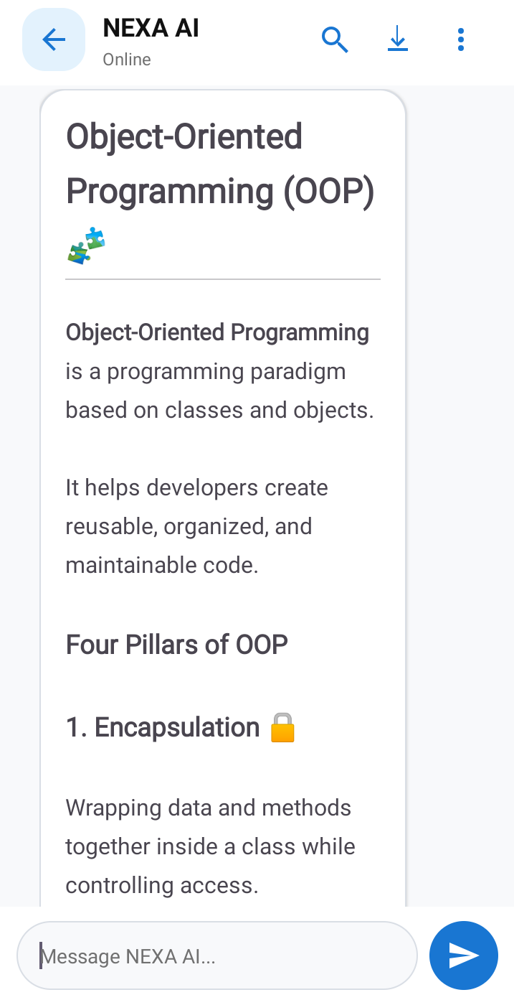
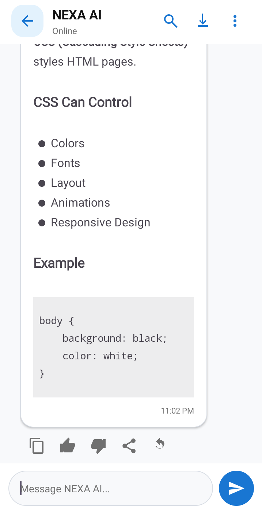
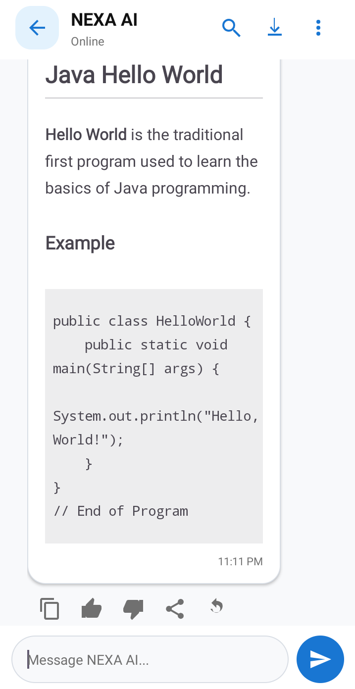
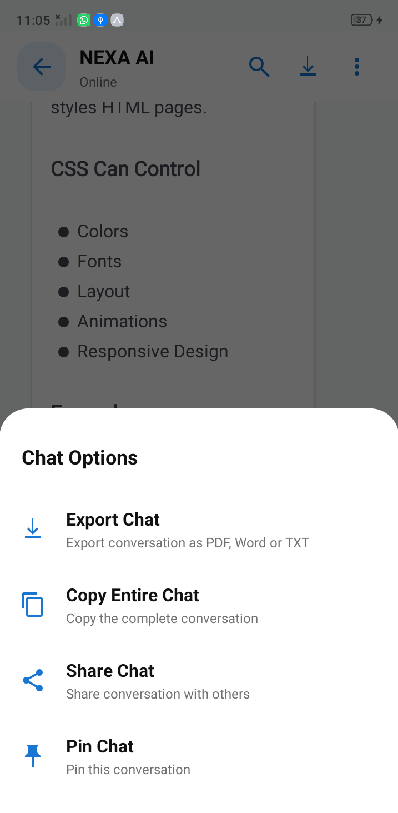
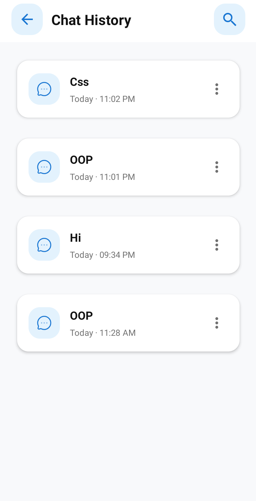

# NEXA-AI
A premium Android AI chat assistant built with Java, Room Database, Retrofit, and OpenAI API.

> A modern Android AI chatbot built using Java, XML, Room Database, Retrofit, and the OpenAI API. NEXA AI delivers a premium conversational experience with persistent chat history, Markdown rendering, syntax-highlighted code blocks, conversation management, and document exporting through a clean Material Design interface.

---

# 📖 About NEXA AI

NEXA AI is a premium Android AI Chat Assistant developed to provide an intelligent, modern, and highly polished conversational experience. Unlike a basic chatbot, NEXA AI has been designed with scalability, maintainability, and future expansion in mind, allowing it to evolve into a complete AI productivity platform.

The application combines modern Android development practices with artificial intelligence to deliver responsive conversations, professional UI design, persistent chat history, markdown rendering, syntax-highlighted programming code, and seamless conversation management.

Built entirely in **Java** using **Android Studio**, NEXA AI demonstrates real-world Android application architecture, local database management, networking, document generation, and AI integration.

---

# ✨ Features

## 🤖 AI Chat

- Real-time AI conversations
- Dynamic user & AI message bubbles
- Typing indicator animation
- Automatic scrolling
- Message timestamps
- Professional AI formatting
- Long response support
- Selectable AI responses

---

## 💬 Conversation Management

- Create new conversations
- Persistent chat history
- Recent conversations
- Dynamic conversation loading
- Automatic message saving
- Professional conversation management
- Room Database integration

---

## 📝 Markdown Rendering

AI responses support:

- Headings
- Bold & Italic text
- Bullet lists
- Numbered lists
- Hyperlinks
- Inline code
- Multi-line code blocks

---

## 💻 Syntax Highlighting

Programming responses include syntax highlighting for:

- Java
- Kotlin
- XML
- Python
- C++
- JavaScript
- SQL
- JSON

---

## 📄 Export Conversations

Export complete conversations to:

- PDF
- Microsoft Word (.docx)
- Plain Text (.txt)

Perfect for documentation, study material, project discussions, and note-taking.

---

## 📋 Copy & Share

- Copy individual AI responses
- Copy complete conversation
- Share messages
- Share entire conversations
- Native Android Share Sheet support

---

## 📌 Chat Options

Professional Material Design Bottom Sheet including:

- Export Chat
- Copy Entire Chat
- Share Chat
- Pin Chat (Placeholder)

Future updates will include:

- Rename Chat
- Delete Chat
- Favorite Chats
- Search Chat
- Conversation Statistics

---

## 🎨 Premium User Interface

- Material Design
- Dark Theme
- Rounded UI Components
- Smooth Animations
- Responsive Layout
- Professional Conversation Design
- Custom Icons

---

# 📸 Application Preview

---

## 🌗 Adaptive Splash Screen

NEXA AI features a fully adaptive splash screen that automatically adjusts to the user's selected application theme, ensuring a seamless and visually consistent startup experience.

When **Dark Mode** is enabled, the application displays a premium dark-themed splash screen with a deep black background, a glowing NEXA AI logo, and colors optimized for low-light environments.

When **Light Mode** is selected, the splash screen instantly switches to a clean and elegant light-themed version featuring a bright background and a dedicated light-mode logo for improved clarity and aesthetics.

This automatic theme-aware behavior provides a polished first impression while maintaining complete visual consistency throughout the application without requiring any manual user interaction.

| 🌙 Dark Mode Splash Screen | ☀️ Light Mode Splash Screen |
|:--------------------------:|:---------------------------:|
|  |  |

## 💬 AI Chat Interface

Modern conversation interface with smooth animations and premium Material Design styling.

---

## 🤖 AI Response

Beautifully formatted AI responses supporting Markdown rendering and rich text formatting.

---

## 💻 Code Highlighting

Programming responses are displayed using syntax highlighting for better readability.

---

## 📄 Export Conversation

Export complete conversations into PDF, Word, or Text documents.

---

## 📚 Conversation History

Persistent Room Database storage allows users to continue previous conversations at any time.

---

# 🛠 Technology Stack

### Languages

- Java
- XML

### Android

- Android Studio
- RecyclerView
- ConstraintLayout
- Material Design Components
- BottomSheetDialog
- FileProvider
- Android Storage Framework

### Database

- Room Database

### Networking

- Retrofit
- Gson Converter

### AI

- OpenAI API

### Libraries

- Markwon (Markdown Rendering)

### Version Control

- Git
- GitHub

---

# 🏗 Architecture

NEXA AI follows a modular Android architecture that separates UI components, data persistence, networking, and business logic into maintainable layers.

The project integrates Room Database for local storage, Retrofit for backend communication, Markwon for Markdown rendering, and OpenAI API integration through a secure backend server.

The architecture has been designed for future scalability, allowing advanced AI tools and productivity features to be added without major structural changes.

---

# 🧪 Developer Mode

NEXA AI includes a built-in **Developer Mode** for testing and demonstration purposes.

When enabled:

- Local AI responses
- No OpenAI API key required
- No API credits consumed
- Offline UI demonstrations
- Portfolio-ready demonstrations

Developer Mode is recommended for evaluating the application without requiring external AI services.

---

# 🌐 Live AI Mode

For real AI-generated responses, users must configure:

- OpenAI API Key
- Backend Server
- Available OpenAI API Credits

Once configured, NEXA AI communicates securely with the backend to generate intelligent responses using the OpenAI API.

---

# 📥 Installation

1. Clone the repository.
2. Open the project in Android Studio.
3. Allow Gradle to synchronize dependencies.
4. Configure the backend server URL.
5. (Optional) Configure your OpenAI API backend.
6. Build and run on an Android device or emulator.

---

# 📦 Download APK

Experience NEXA AI without opening Android Studio.

Download the latest APK release and explore the application's premium interface, intelligent conversation system, Markdown rendering, document exporting, and professional Android user experience.

| Information | Details |
|-------------|---------|
| 📦 Version | v1.0 |
| 📱 Platform | Android |
| ⚙️ Minimum SDK | API 26 |
| 🛠 Built With | Java & XML |
| 🤖 AI | OpenAI API |
| 📅 Release | August 2026 |

> **Developer Mode:** Enable Developer Mode to explore all core application features without requiring an OpenAI API key or API credits.

---

# 🚀 Future Roadmap

The following features are planned for future releases:

- 🔍 Search Inside Chat
- ✏️ Rename Conversations
- 🗑 Delete Conversations
- ⭐ Favorite Chats
- 📌 Fully Functional Pin Chat
- 📊 Conversation Statistics
- 🧠 AI Memory
- 🎙 Voice Input
- 🔊 Voice Output
- 🌍 Multi-language Support
- 🎨 Theme Customization
- ☁️ Cloud Synchronization
- 💾 Conversation Backup & Restore
- 📎 File Attachments
- 🖼 Image Understanding
- 🎨 AI Image Generation
- 🛠 Advanced AI Productivity Tools

---

# 👨‍💻 Developer

## Asad Ali Khan

Computer Science Student • Android Developer • AI Application Developer

Passionate about building premium Android applications powered by Artificial Intelligence. My interests include Android Development, AI Integration, Backend Development, modern UI/UX design, and creating scalable software solutions that solve real-world problems.

### Connect With Me

- GitHub: https://github.com/Asad-KhanDev
- LinkedIn: https://www.linkedin.com/in/asad-ali-khan-b76325335
- Upwork: https://www.upwork.com/freelancers/~011be02e85d9578791

---

# ⭐ Support the Project

If you found NEXA AI useful or inspiring, please consider giving this repository a ⭐.

Your support motivates future development and continuous improvement.

---

# 📄 License

This project is intended for portfolio demonstration, educational purposes, and Android development learning.

© 2026 Asad Ali Khan. All Rights Reserved.
